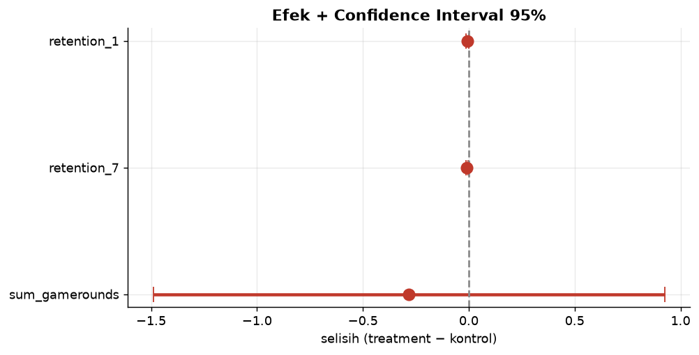
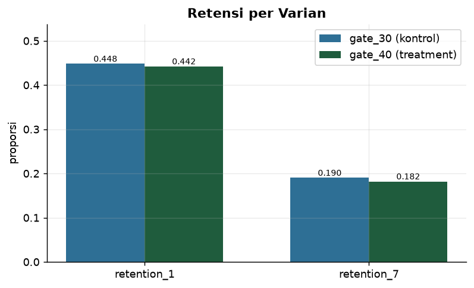
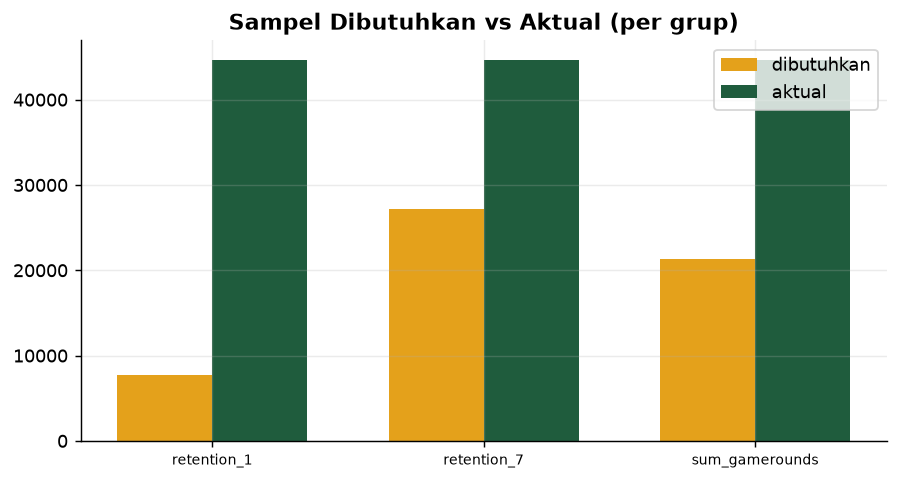
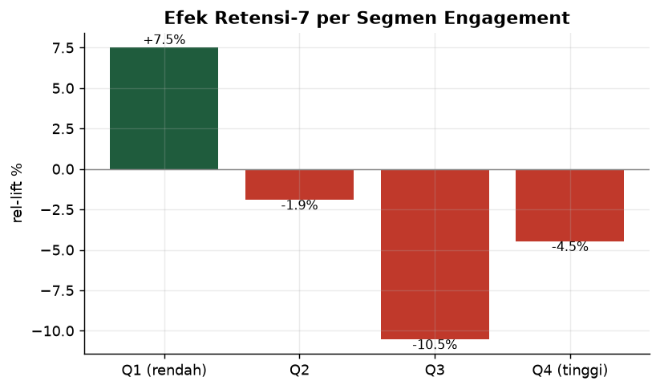

<div align="center">


### 🔗 [**Buka A/B Testing Lab →**](https://ab-testing-lab.streamlit.app)

</div>

---

## 🧪 Apa ini?

**Analisis A/B testing yang benar** — bukan sekadar "bandingkan rata-rata".
Project ini menerapkan **statistik inferensial penuh**: uji hipotesis,
confidence interval, power analysis, koreksi multiple-testing, deteksi SRM,
efek heterogen, dan CUPED — semuanya **diuji otomatis** untuk kebenarannya.

**Studi kasus:** Cookie Cats memindahkan gate dari level 30 → 40 pada
**90.189 pemain**. Apakah keputusan itu menguntungkan?

```bash
python src/run_pipeline.py     # ingest → analyze → tests → charts
streamlit run app/dashboard.py
```

---

## 🎯 Temuan (berbasis bukti)

| Metrik | Kontrol (gate_30) | Treatment (gate_40) | Rel-lift | p (raw) | p (adj) | Signifikan? |
|---|---:|---:|---:|---:|---:|:--:|
| Retensi Hari-1 | 0.4482 | 0.4423 | **−1.32%** | 0.074 | 0.112 | ❌ |
| **Retensi Hari-7** | 0.1902 | 0.1820 | **−4.31%** | **0.0016** | **0.0047** | ✅ |
| Jumlah Ronde | 50.09 | 49.81 | −0.56% | 0.647 | 0.647 | ❌ |

**Kesimpulan:** memindahkan gate 30→40 **menurunkan retensi hari-7 secara
signifikan** (−4.31%, tetap signifikan setelah koreksi FDR).
**Rekomendasi: JANGAN** pindahkan gate ke level 40.

**Efek heterogen:** dampak terbesar pada segmen engagement menengah (Q3: −10.5%).

---

## 📊 Visualisasi

### Efek + Confidence Interval 95%



> **Kenapa** — estimasi titik menyesatkan tanpa ketidakpastian.
> **Tujuan** — seberapa besar efeknya & seberapa yakin kita?
> **Dampak** — batang CI yang tidak melewati 0 = efek nyata. Retensi-7 jelas negatif.

### Retensi per varian



> **Kenapa** — perbedaan mentah adalah titik mulai analisis.
> **Tujuan** — gambaran deskriptif arah efek.
> **Dampak** — gate_40 lebih rendah di kedua metrik retensi.

### Power analysis



> **Kenapa** — sampel terlalu kecil → gagal deteksi efek nyata (Type II).
> **Tujuan** — apakah kita punya cukup data?
> **Dampak** — mencegah salah tafsir "tidak signifikan" sebagai "tidak ada efek".

### Efek per segmen engagement



> **Kenapa** — efek rata-rata menyembunyikan perbedaan antar-pengguna.
> **Tujuan** — SIAPA yang terpengaruh?
> **Dampak** — dasar personalisasi / rollout bertahap.

---

## 🔬 Metode statistik

| Metode | Dipakai untuk |
|---|---|
| **2-proporsi z-test** | metrik biner (retensi) |
| **Welch t-test** | metrik kontinu (ronde), tahan varians tak-sama |
| **Bootstrap CI** | verifikasi silang CI analitis |
| **Power analysis** | n dibutuhkan & power tercapai (statsmodels) |
| **Benjamini-Hochberg FDR** | koreksi multiple-testing |
| **SRM check** (chi-square) | gerbang validitas eksperimen |
| **Efek heterogen** | lift per segmen engagement |
| **CUPED** | variance reduction (kovariat pra-periode) |

---

## 🧪 Kualitas & validitas (18 uji otomatis)

```
PASS  userid unik (unit eksperimen)
PASS  alokasi grup dekat 50:50 (SRM)
PASS  retention_7: CI mencakup estimasi
PASS  retention_7: p_adj >= p_raw
PASS  retention_7: CI & p-value konsisten
PASS  uji deterministik (p stabil)
...
[dq] SEMUA UJI LULUS
```

Uji memverifikasi **validitas statistik**, bukan hanya kebersihan data —
termasuk konsistensi antara CI dan p-value, dan determinisme uji.

---

## ⚠️ Keterbatasan (jujur)

- **Satu dataset, satu domain** (mobile game) — generalisasi perlu replikasi.
- **Uji dua-sisi** (lebih ketat, lebih jujur daripada satu-sisi).
- **Efek segmen bersifat eksploratif** — p-value segmen tidak dikoreksi
  terpisah; jangan jadikan klaim konfirmatori tanpa praregistrasi.
- **Metrik kontinu di-cap** pada persentil 99.9 (data sangat skewed).
- Klaim kausal valid selama randomisasi bersih — **terverifikasi via SRM**.

Lihat [`docs/ADR.md`](docs/ADR.md) untuk keputusan metodologis lengkap.

---

## 📁 Struktur

```
ab-testing-lab/
├── src/
│   ├── config.py          # path, definisi eksperimen, parameter statistik
│   ├── ingest.py          # unduh dataset → staging
│   ├── load_db.py         # → DuckDB
│   ├── stats.py           # ★ modul statistik (9 metode)
│   ├── analyze.py         # uji & tulis hasil ke marts
│   ├── explanations.py    # narasi Kenapa·Tujuan·Dampak
│   ├── make_charts.py     # PNG README
│   └── run_pipeline.py    # orkestrator
├── sql/{schema,transform}.sql
├── tests/test_data_quality.py   # 18 uji (data + validitas statistik)
├── app/dashboard.py       # Streamlit
├── docs/ADR.md
└── reports/figures/       # PNG
```

---

## 🚀 Quick Start

```bash
pip install -r requirements.txt
python src/run_pipeline.py
streamlit run app/dashboard.py
```

---

## 🛠️ Tech Stack

| Layer | Teknologi |
|---|---|
| **Statistik** | scipy · statsmodels |
| **Database** | DuckDB (embedded OLAP) |
| **Pipeline** | Python stdlib + pandas |
| **Visualisasi** | Plotly · matplotlib |
| **Dashboard** | Streamlit |
| **Data** | Cookie Cats (90.189 pemain) + Udacity AB (replikasi) |

---

<!-- INSIGHTS:START -->
## 💡 Insight & Rekomendasi (per analisis)

_Setiap analisis disertai kesimpulan, rekomendasi tindakan, dan risiko bila diabaikan — bukan sekadar angka._

### 🔴 KPI / Ringkasan
**Kesimpulan.** Eksperimen gate 30→40 melibatkan 90.189 pemain (seimbang, SRM bersih). Dari 3 metrik yang diuji, hanya RETENSI HARI-7 yang berubah secara signifikan — dan arahnya NEGATIF (−4.31%). Dua metrik lain tidak signifikan, artinya belum ada bukti perbedaan nyata.

**Rekomendasi tindakan:**
- JANGAN rilis gate level 40 secara penuh — bukti menunjukkan kerugian retensi.
- Bila tetap ingin menguji gate, uji posisi/nilai lain (mis. level 35, 50) dengan durasi & sampel yang direncanakan lewat power analysis.
- Dokumentasikan keputusan ini sebagai preseden: perubahan onboarding berisiko tinggi terhadap retensi jangka panjang.

**⚠️ Risiko bila diabaikan.** Bila gate 40 dirilis karena 'angka mentah retensi-1 terlihat mirip', kamu kehilangan ~4% pengguna yang kembali di hari-7 untuk setiap 100 pemain baru. Pada skala 90rb, itu ribuan pengguna hilang per siklus — dan efeknya menumpuk diam-diam karena retensi-1 tidak menunjukkannya.

### 🟠 Hasil Uji Statistik
**Kesimpulan.** Setelah koreksi Benjamini-Hochberg (FDR), hanya retensi-7 yang lolos signifikansi (p_adj=0.0047). Retensi-1 (p_adj=0.112) dan jumlah ronde (p_adj=0.647) TIDAK signifikan — perbedaan mereka paling mungkin kebetulan. Ini contoh penting: dua metrik bisa 'tampak berbeda' namun tidak meyakinkan secara statistik.

**Rekomendasi tindakan:**
- Ambil keputusan HANYA dari baris dengan signifikan_adj = True.
- Untuk metrik non-signifikan, jangan simpulkan 'tidak ada efek' — kata yang benar: 'belum ada bukti cukup' (cek power di tab Power).
- Laporkan p_adj, bukan hanya p mentah, di setiap ringkasan ke stakeholder.

**⚠️ Risiko bila diabaikan.** Menjadikan retensi-1 'menang' padahal tidak signifikan adalah bentuk p-hacking yang halus. Keputusan berbasis derau → fitur dirilis tanpa manfaat nyata, biaya engineering terbuang, dan tim kehilangan kepercayaan pada proses eksperimen.

### 🟠 Efek & Confidence Interval
**Kesimpulan.** Interval kepercayaan 95% untuk retensi-7 seluruhnya berada di bawah 0 (tidak melewati garis nol) → efek negatif ini nyata, bukan kebetulan. Untuk retensi-1 dan ronde, CI melewati nol → arah efek belum dapat dipastikan. Lebar CI menunjukkan seberapa presisi estimasi kita.

**Rekomendasi tindakan:**
- Gunakan lebar CI untuk menilai kesiapan keputusan: CI sempit & jauh dari 0 = aman memutuskan; CI lebar = perpanjang/ perbesar sampel.
- Sampaikan ke stakeholder dalam bahasa rentang: 'retensi-7 turun antara X% dan Y%', bukan satu angka tunggal yang terlihat pasti.
- Untuk metrik dengan CI melewati 0, jalankan eksperimen lanjutan sebelum memutuskan apa pun.

**⚠️ Risiko bila diabaikan.** Melaporkan hanya estimasi titik (mis. '-4.3%') menyembunyikan ketidakpastian. Jika efek sebenarnya bisa jauh lebih buruk (ujung bawah CI), keputusan yang terlihat 'aman' bisa merugikan lebih besar dari dugaan.

### 🟠 Segments
**Kesimpulan.** Efek TIDAK seragam. Segmen engagement menengah (Q3) paling terdampak negatif (−10.5%), sementara segmen terendah (Q1) justru sedikit positif. Ini menunjukkan gate 40 mengganggu pengguna yang sedang membangun kebiasaan bermain — kelompok paling bernilai untuk konversi jangka panjang.

**Rekomendasi tindakan:**
- Fokus investigasi produk pada pengguna engagement menengah: apa yang membuat mereka berhenti saat mencapai gate level 40?
- Jika tetap ingin menguji gate, pertimbangkan rollout HANYA ke segmen berisiko rendah (Q1) sebagai pembelajaran, bukan ke semua orang.
- Jadikan segmentasi sebagai standar: jangan pernah puas dengan 'efek rata-rata'.

**⚠️ Risiko bila diabaikan.** Membaca hanya efek rata-rata (−4.3%) menyembunyikan bahwa sebagian segmen jatuh −10.5%. Keputusan berbasis rata-rata bisa menghancurkan segmen bernilai tinggi tanpa terlihat di dashboard — kerugian tersembunyi.

### 🔵 Power
**Kesimpulan.** Eksperimen punya sampel BESAR (≥44rb per grup), cukup untuk mendeteksi efek sekecil ~5% relatif dengan power 80%. Artinya, saat hasil berkata 'tidak signifikan' (retensi-1, ronde), itu benar-benar berarti efeknya kecil — BUKAN karena kurang data.

**Rekomendasi tindakan:**
- Percayai hasil 'tidak signifikan' di sini: dengan power tinggi, itu memang bukti ketiadaan efek yang praktis berarti.
- Untuk eksperimen berikutnya, hitung n dibutuhkan SEBELUM mulai (gunakan fungsi power_proportion/power_mean di src/stats.py).
- Tetapkan MDE (minimum detectable effect) yang bermakna bisnis sejak awal, bukan setelah melihat hasil.

**⚠️ Risiko bila diabaikan.** Menjalankan eksperimen tanpa power analysis berisiko dua arah: sampel kurang → efek nyata terlewat (Type II); sampel berlebih → biaya & waktu terbuang. Keduanya menghasilkan keputusan yang salah atau tidak efisien.

### 🟢 SRM
**Kesimpulan.** Alokasi grup mendekati 50:50 dan uji SRM tidak menemukan penyimpangan (p tinggi). Ini berarti randomisasi berjalan benar — prasyarat WAJIB agar kesimpulan kita bisa disebut kausal, bukan sekadar korelasional.

**Rekomendasi tindakan:**
- Jadikan SRM check sebagai langkah WAJIB pertama di setiap analisis eksperimen — sebelum melihat metrik apa pun.
- Catat p-value SRM di laporan; bila suatu saat p<0.001, hentikan analisis.
- Otomatiskan pemeriksaan ini di pipeline agar tidak bisa dilewati.

**⚠️ Risiko bila diabaikan.** Jika randomisasi cacat (SRM) dan kita tetap menganalisis, seluruh kesimpulan — termasuk yang 'signifikan' — tidak dapat dipercaya. Keputusan produk berbasis eksperimen rusak akan lebih buruk daripada tidak bereksperimen sama sekali.

<!-- INSIGHTS:END -->

## 👤 Author

<div align="center">

**Sandi Ridwan** — Data Analyst · Data Automation Engineer · Python

📍 Palu, Central Sulawesi, Indonesia

[](https://www.upwork.com/freelancers/~011f6d0fbb4a372974)
[](https://linkedin.com/in/sandi-ridwan)
[](https://github.com/SandiRidwan)

</div>

## 📄 License

MIT — Educational & portfolio. Dataset Cookie Cats (publik, Kaggle/GitHub).
